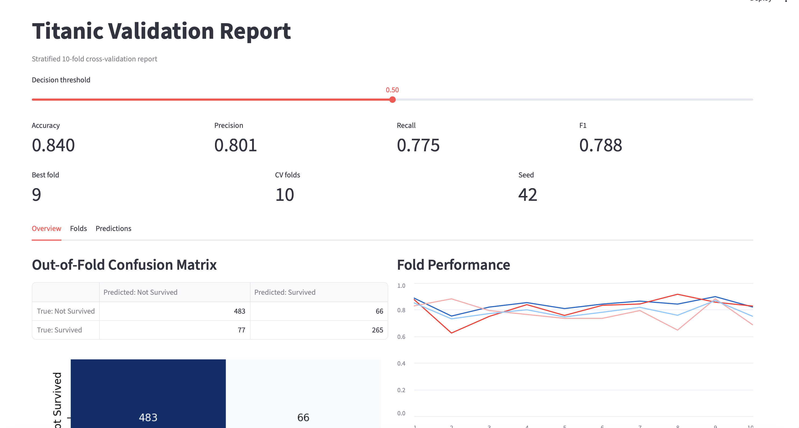
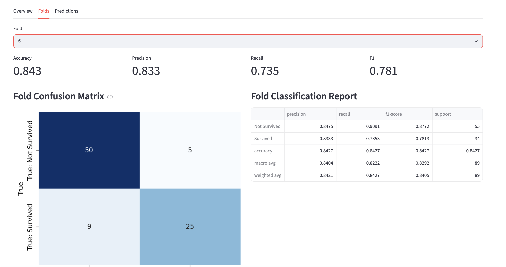
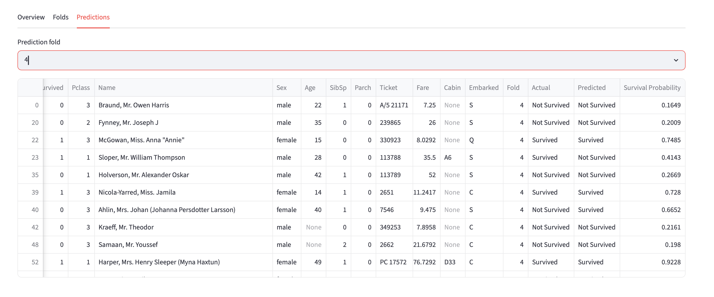
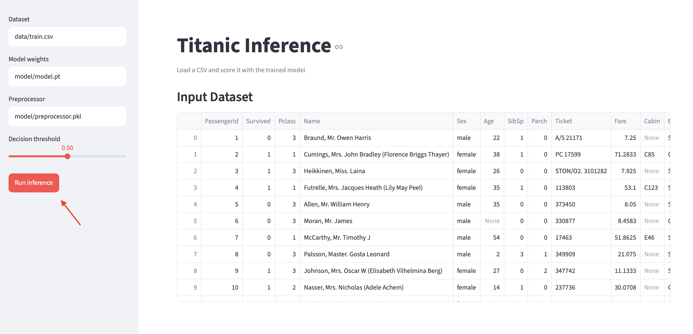
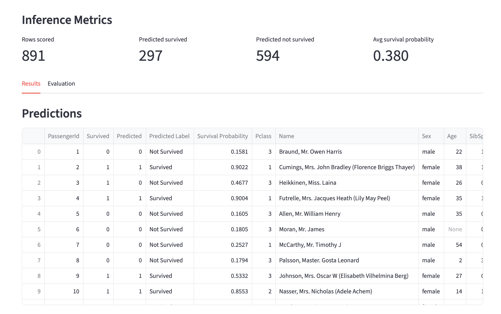
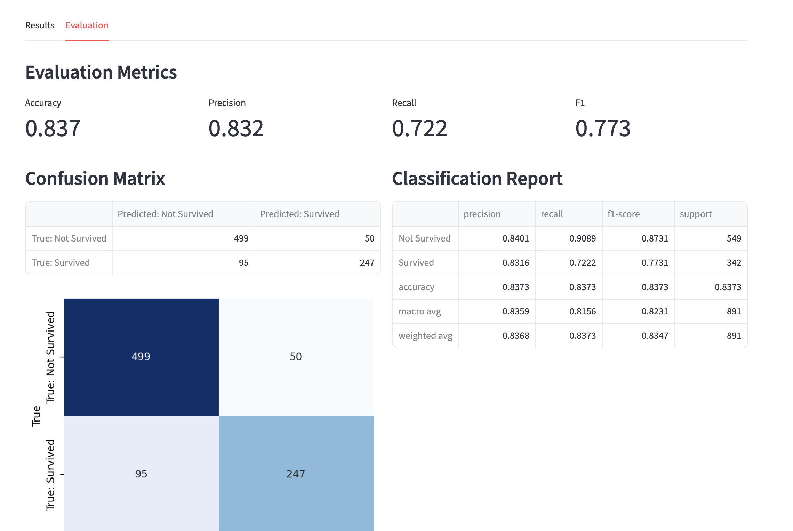

# Interview

This project builds an end-to-end machine learning workflow for the Titanic survival prediction task. It starts with exploratory data analysis, continues into a reproducible PyTorch training pipeline, and finishes with Streamlit apps for reviewing validation results and running inference on new CSV files.

The goal is to keep the workflow practical and easy to inspect: preprocessing is saved with the model, validation results are written to disk, and the Streamlit interfaces make it simple to evaluate the trained model or score another dataset without changing code.

## Setup and installation
First clone the project
```bash
git clone https://github.com/TaliaSeada/Interview.git
cd Interviw
```

Then create an environment:
```bash
python3.12 -m venv .venv
source .venv/bin/activate
```

And download all requerments:
```bash
pip install -r requirements.txt
```

If `python3.12` is not available on your machine, use another Python 3.12 interpreter path.

## Run

EDA:

To run the EDA botebook, simply open it, select the .venv as the kernel, and run the cells.

Train the model:

```bash
python train.py
```

This runs stratified 10-fold cross-validation with the final model architecture and saves the best fold artifacts to `model/model.pt` and `model/preprocessor.pkl`.
It also saves `model/cv_results.csv`, `model/cv_predictions.csv`, and `model/cv_metadata.json` for the Streamlit report.
The pipeline uses a fixed random seed of `42` for fold splitting, PyTorch initialization, and DataLoader shuffling.

Run the validation report app:

```bash
streamlit run validation_app.py
```

This app reloads the saved cross-validation artifacts and displays validation metrics, fold-by-fold results, and validation predictions.

Inside the app you will see the evaluation matrics of the model results, where you can choose the threshold.
In the first page you will see an overview of the results of the model on the whole data, with accuracy, precision, recall, Fi-score, best fold, how many folds I chose, the seed and some plots.


In the `Folds` tab, you can choose between the folds to see each ones results:


And in the `Predictions`, you can see each folds prediction results:


Run the inference app:

```bash
streamlit run inference_app.py
```

This app accepts a dataset CSV path, loads `model/model.pt` and `model/preprocessor.pkl`, runs inference, and shows predictions. If the CSV includes `Survived`, it also shows evaluation metrics and plots.

Inside the app, you can choose the dataset path, the model weights to use, and the preprocessor.
Then you can control the decision threshold for the evaluation.
To recive results you need to click the `Run inference` button, as shown here:


Once you click the button, the inference is running with the data you chose, when its finished the result will show up:

You can click the `Evaluation` button, and the evaluation plots will show up:



Open notebooks:

```bash
jupyter lab
```
## Architecture and Design 

The project is split into three main parts: exploratory analysis in `EDA.ipynb`, model training in `train.py`, and Streamlit interfaces for validation and inference.

The training script uses a reproducible PyTorch binary classifier for Titanic survival prediction. Feature engineering is kept in code so the same transformations can be reused at training and inference time: missing age values are filled by `Sex` and `Pclass` groups, passenger title and family size are extracted, and a `HasCabin` indicator is added. Numerical features are imputed and scaled, categorical features are imputed and one-hot encoded, and already numeric categorical indicators such as `Pclass` and `HasCabin` are passed through without scaling.

Model evaluation uses stratified 10-fold cross-validation to preserve the survival class ratio in every fold. I chose 10 fold instead of the 5 fold usually used because I wanted a ration of 10/90% since I do not have alot of training data and I am using a neural network. The script saves the best fold model weights, fitted preprocessor, fold metrics, out-of-fold predictions, and metadata under `model/`.
When building the model, I used few different architectures and compared their results - then chose the one that produced the highest results.

The Streamlit UI is intentionally split into two apps. `validation_app.py` presents the saved validation results from training, while `inference_app.py` loads the trained model and preprocessor from disk, accepts a CSV path, runs inference, and shows predictions plus evaluation metrics when labels are available.